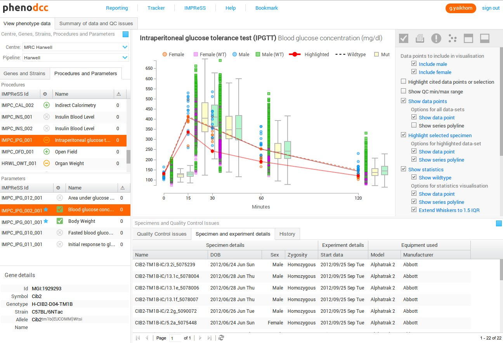

# Quality Control Tool

The **PhenoDCC Quality Control Tool** is a web application for
carrying out quality control of phenotype data. It provides an
interactive user interface through which mouse phenotype data can be
visualised, analysed and understood. This tool allows a user to raise
any quality control issues (e.g., data transfer errors) before the
data is archived at the central data archive hosted at
[EMBL-EBI](http://www.ebi.ac.uk/services/teams/impc).

## Salient features

A few of the features provided by _PhenoDCC QC Tool_ are:

* It allows a user to view data from multiple centres for multiple [parameters](https://www.mousephenotype.org/impress).
* It is a web-based tool which is accessible from anywhere around the world using a modern internet web browser.
* It provides facilities to select data points and raise issues with a data set.
* It allows a user to track and discuss issues.
* It allows a user to track the history of actions that were carried out to a data set.
* Visualisations and QC issues can be bookmarked and shared.

_The PhenoDCC QC Tool is only accessible to registered users._

Please [contact us](https://www.mousephenotype.org/contact-us) for further details.

