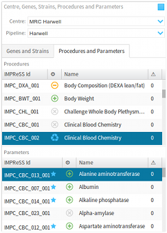
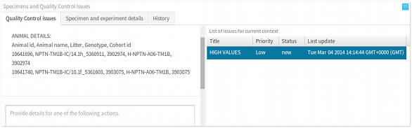

% Users' Manual: _Quality Control Web Application_
% The PhenoDCC Team
% Last updated: 19 July 2013

This users' manual describes version 2 of the
_Quality Control Web Application_.

# Introduction

The _PhenoDCC Quality Control_ web application allows a user to
visualise phenotype data collected from various research institutes,
and to identify and discuss possible quality control issues with the
data before they are signed-off for further scientific analysis.

## Target users

The quality control web application was designed primarily for
1) _data managers_ at the various participating research centres
carrying out the phenotyping experiments and producing the data, and
2) for the _data wranglers_ who are responsible for identifying and
raising quality control issues with the data. Using this web
application, both the data managers and data wranglers can discuss any
quality control issues inside the same platform, allowing quicker
turn-around time for resolving issues. Furthermore, other users can
also see the progress of the data, as they are submitted by the
phenotyping centres.

## Accessing the web application

The PhenoDCC web application is accessed using a standard web browser,
such as Google Chrome, by visiting the appropriate server. Once the
application has been loaded, the web app is ready for
usage. Depending on the internet connection speed, loading the
web application may take a while. While the application is being
loaded, you will see the following screen on your browser.

![Web application is loading...][startup]

Once the application has been loaded, you will see the following
screen on your browser.

![Web application has loaded successfully][loaded]

## The overall process

In order to visualise phenotype data, we must specify the context
which selects the required data that we wish to analyse. This is
referred to as the _data context_. In the PhenoDCC web application, a
data context is defined by the following variables:

1. **Centre** The centre that was responsible for experimenting and
collecting the phenotype data. This variable is named `cid` in the
data context.

2. **Pipeline** The phenotyping pipeline under which the procedures
were carried out. This variable is named `lid` in the data context.

3. **Genotype** The genotype that is associated with the mouse specimens
on which the experiments were carried out. This variable is named
`gid` in the data context.

4. **Background strain** The specific background strain of the selected
genotype. This variable is named `sid` in the data context.

5. **Procedure** The type of experimental procedure that was carried out
on the selected specimens. This variable is named `peid` in the
data context.

6. **Parameter** While carrying out an experimental procedure, various
results and observations are recorded using the _standard operating
protocols_ (SOP) defined in [IMPReSS][impress]. Each of these results are
recorded under a well defined parameter. This variable is named
`qeid` in the data context.

Once the data context is defined, the PhenoDCC web application will
display the required visualisation of the available data, or alert
the user if no visualisation could be rendered. In fact, it is
possible to start the PhenoDCC web application using a given data
context (see [Initialising the web
application](#initialising-the-web-application)).

## Components of the user interface

The user interface for the PhenoDCC web application is divided into
several visual components. Each of these corresponds to a clearly
defined function. The icons are explained in
[Understanding the icons](#understanding-the-icons) section.

### Toolbar, centre, genes and strains

* **Toolbar** The toolbar allows the user to navigate to other related
   web applications, such as the tracker. It also provides interfaces
   for signing in, or signing out.

</img>

* **Centre selector** The centre selector is a drop-down menu which
   lists all of the participating centres that are producing
   phenotype data. Selecting the centre is the first step of
   specifying a data context. The contents of the genes/strains panel,
   discussed below, depends on the centre selected here. Selecting a
   centre alters the data context by updating the centre (`cid`).

</img>

* **Pipeline selector** The pipeline selector is a drop-down menu which
   lists all of the pipelines that are associated with the selected
   centre. Selecting the pipeline is the next step of specifying a data
   context. The contents of the genes/strains panel and the procedures
   panel depend on the selected pipeline. Selecting a pipeline alters
   the data context by updating the pipeline (`lid`).

* **Genes/strains search box** The genes/strains search box allows a user
   to search for specific genes, or background strains. The search is
   _case-insensitive_ and _interactive_, as it triggers as soon as
   the text in the search box is altered. The search returns items
   where the genotype or background strain matches the searched
   string, both partially or completely. The results of the search are
   displayed in the genes/strains panel, discussed below. In fact,
   this search box acts as a filter for the genes/strains panel.

* **Genes/strains panel** The genes/strains panel displays a list of
   genotypes and corresponding background strains. Clicking on a
   genotype expands (or contracts) the list of background strains
   associated with it. Clicking on a background strain alters the data
   context by updating the genotype (`gid`) and background strain
   (`sid`). The genes/strains search box, discussed above, can be used
   as a filter to trim this list.

* **Data context details** The data context details panel displays
   information relevant to the currently active data context.

</img>

### Procedures, parameters and specimens

</img>

* **Procedures panel** The procedures panel lists all of the experimental
   procedures defined in the [IMPReSS][impress] database. Clicking on a panel
   item alters the data context by updating the procedure id
   (`peid`). Furthermore, this also triggers an update of the
   parameters panel, which only list parameters that are associated
   with the selected procedure, and also the specimens panel, which
   list all of the mouse specimens on which the procedure was carried
   out.

* **Parameters panel** The parameters panel lists all of the parameters
   that are associated with a procedure. These parameters are defined in
   the [IMPReSS][impress] database. Clicking on a panel item alters the data
   context by updating the parameter id (`qeid`). The list of
   parameters displayed in this panel depends on the procedure
   selected in the procedures panel, as discussed above.

* **Specimens panel** The specimens panel lists all of the mouse
   specimens on which a procedure was carried out. Further to the
   specimen details, such as data-of-birth, sex, zygosity etc., this
   panel also displays details concerning the experimenter, experiment
   date, and the equipment that was used to carry out the procedure
   and record the results and observations. As discussed above, the
   list of specimens displayed in this panel depends on the procedure
   selected in the procedures panel.

</img>

   
### Quality control issues and actions

* **Issues panel** The issues panel lists all of the
   quality control issues that have been raised in the current data
   context. This panel provides information, such as brief summary,
   priority, status etc., that are relevant to studying, discussing
   and resolving a quality control issue. When an issue is selected,
   all of the data points that are associated with the issue are
   highlighted in the visualisation, as discussed below. Furthermore,
   selecting an issue updates the list of associated actions in the
   actions panel, also discussed in the following section.

</img>

* **Actions panel** The actions panel lists all of the actions that are
   associated with an issue. There are several types of actions, some
   of which are raising an issue, commenting on an issue, and
   resolving an issue. The actions panel gets updated when an issue is
   selected in the issues panel. The actions panel also contains the
   interface for commenting on an an existing issue (see [Commenting
   on issues](#commenting-on-issues)).

</img>

* **History panel** The history panel displays a timeline that provides
   an overview of what has been happening to the data context. It
   begins when there was no data available for that context, until the
   most recent activity on that context. Each activity, for example,
   data upload, removal or modification; or issue creation and resolution,
   etc. are recorded and displayed in this timeline. The icons are
   explained in [Understanding the icons](#understanding-the-icons) section.

</img>

### Visualisation and controls

* **Visualisation** The visualisation is the most important component of
   the PhenoDCC quality control web application. This is where the
   data is visualised as _interactive_ graphs, charts, and more. This
   is where a user can get further details about a specific data
   point, and also select data points for raising quality control
   issues. We shall discuss the visualisation components in detail in
   later sections.

</img>

* **Visualisation controls** The visualisation controls is a
   context-sensitive panel that displays a collection of items that
   control the manner in which the data is visualised. For instance,
   it allows a user to interactively include, or discard, certain
   visual details from the visualisation, thus enhancing the
   analysis. We shall discuss the specific functions of each of the
   control items in detail in later sections.

# Visualise phenotype measurements

To visualise phenotype measurements, specify the data context by
selecting the following:

1. Select a centre. This will update the genes/strains panel, and will
   lists only those genotypes and background strains pertinent to the
   centre just selected.

2. Select a pipeline. This will update the genes/strains panel, and will
   lists only those genotypes and background strains pertinent to the
   pipeline just selected.

3. Search for a specific genotype, or background strain. This will
   filter the list of genotypes and background strains in the
   genes/strains panel.

4. Select a background strain from the list. This will update the data
   context details panel.

5. We must now select the procedures and parameters, but before we do
   that, we must first activate the procedures/parameters panel. To do
   this, click on the _Procedures and parameters_ tab, as shown above.

6. Select the procedure that we wish to investigate. This will update
   the list of parameters in the parameters panel.

7. Select the parameter that we wish to analyse. This completely
   defines a data context. If there are data available for this
   context, these will now be displayed in the visualisation
   panel.

## Visualisation controls

### Maximise/minimise visualisation

Clicking on the </img>
button maximises the visualisation by hiding the _Centre, Genes, Strains, Procedures and Parameters_
panel; and the _Specimens and Quality Control
Issues_ panel. This is shown below. If the visualisation is
already maximised, the control has no effect.

![Maximised visualisation][maximise_visualisation]

Clicking on the </img>
button minimises the visualisation by showing the _Centre, Genes, Strains, Procedures and Parameters_
panel; and the _Specimens and Quality Control
Issues_ panel. This is shown below. If the visualisation is
already minimised, the control has no effect.

![Minimised visualisation][minimise_visualisation]

### Using the cross-hair

If the _Cross hair_ control is checked,
the visualisation will display a _cross-hair_ with two line segments,
one vertical and the other horizontal, so that they intersect at the
location of the mouse pointer. When the user moves the mouse cursor
over the visualisation, the cross-hair will interactively update to
reflect the mouse movement. A cross-hair makes it easy to view the
data points relative to the _x_ and _y_ axes, and also allows a user
to check if certain data points have similar values.

![Visualisation with cross-hair][show_crosshair]

### Vertical and horizontal axes

Unchecking the _X-axis and label_
control hides the _x_-axis line, ticks, and the axis label. Similarly,
unchecking the _Y-axis and label_
control hides the _y_-axis line, ticks, and the axis label. This is
shown below.

![Hidden axes and labels][hide_axes]

### Highlighting specimen data-points

To highlight the data points that correspond to a specific specimen,
simply select the required specimen from the _Specimens_ panel. The visualisation will
refresh, and the data-points that correspond to the specimen will be
highlighted. This is shown below.

![Select specimen to highlight corresponding data-points][select_specimen]

### Getting data point details

Hovering over a data point will pop-up an information box that
displays further details about the data point, as shown below. The
icons are explained in [Understanding the
icons](#understanding-the-icons) section.

![Show data point details by hovering][show_datapoint_detail]

The placement of the information box depends on the position of the
mouse pointer over the visualisation. The web application will ensure
that it is always displayed inside the visible region. By default the
information box is displayed in the 4th quadrant relative to the mouse
position, as this makes reading the details easier. However, if such a
placement is not possible, the web application will automatically
choose an appropriate alternative placement.

### Show/hide all of the data points

Checking the _Show data points_
control displays all of the data points that are associated with all
of the specimens listed in the _Specimens_
panel. Furthermore, this will also expand a sub-group of controls, if
it is relevant, that allows a user to refine the visualisation. For
instance, if the plot is a _series_, the sub-group will consists of
control for showing or hiding circles and polylines. The following
screen-shot displays all of the data points for both mutant and
wildtype specimens.

![Visualise all of the data points][both_male_female]

### Filter data points by gender

By checking or unchecking the _Include
male_ and _Include female_
controls, a user can filter out data points by gender. These are shown
below.

![Filter out data points that correspond to female specimens][only_male]

![Filter out data points that correspond to male specimens][only_female]

## Visualising statistical information

The PhenoDCC web application allows a user to visualise statistical
information about the data points. Statistical visualisation is
enabled by checking the _Show
statistics_ control. This expands the control subgroup which
allows a user to select statistical information that they wish to
visualise.

![Statistical visualisation showing 1st and 3rd quartiles][show_1_3_quartiles]

The above screen-shot shows an example statistical visualisation, which
displays the first and third quartiles for all the data sets (grouped by
_x_-axis values). Note that we have hidden all of the data points that
correspond to the highlighted specimen by unchecking the _Highlight selected specimen_ control.

It is possible to show, or hide, the data point circles and the series
polyline by checking, or unchecking, the _Show
data point_ and _Show series
polyline_ respectively. Unlike circles that correspond to data
points, circles that correspond to statistical information cannot be
selected; furthermore, hovering over these circles will have no
effect.

### Maxima, minima, mean, median and quartiles

It is possible to combine several statistical information to render a
combined visualisation, as shown below.

![Visualise maxima and mean][show_mean_max]

### Box-and-Whisker plots

A [box-and-whisker plot](http://en.wikipedia.org/wiki/Box_and_whisker_plot)
allows visualisation of the [quartiles](http://en.wikipedia.org/wiki/Quartile)
and regions that are either within 1.5 times the inter-quartile
range (IQR), or the range. This can be enabled by checking the _Box-plot with whiskers_ control in the
**Statistics type** section, as shown below.

![Visualising box and whisker plot][show_box_plot]

There are two choices for specifying how far the whiskers are
extended. These are:

1. Extend to show the range, in which case the lower whisker extends
   to the minima, and the upper whisker extends to the maxima.

2. Extend 1.5 times the inter-quartile range, in which case the lower
   whisker extends 1.5 x IQR below the first quartile, and the upper
   whisker extends 1.5 x IQR above the third quartile.

![Extends whiskers to cover range][show_box_plot_with_data_points]

![Extends whiskers to 1.5 x IQR][show_box_plot_iqr]

### Standard error bars

To show [error-bars](http://en.wikipedia.org/wiki/Error_bars) for a
highlighted data set, check the _Standard error_
control in the **Statistics type** section. The error bars are visualised as
one [standard error](http://en.wikipedia.org/wiki/Standard_error) 
off the data point values.

![Show error-bars with highlighted data set][show_standard_error]

### Show/hide wildtype statistics

To visualise statistical information that correspond to wildtype (or,
wild type) data, check the _Show
wildtype_ control in the _Show
statistics_ control subgroup. This will first scale the
_y_-axis to fit the wildtype data points, and then show the related
statistical information. For instance, in the following screen-shot,
we display the arithmetic mean for the mutant data set, as well as the
arithmetic mean for the corresponding wildtype data-set.

![Visualise wildtype statistical information][show_wildtype]

# Quality control issues

The ability to raise an issue is one of the main facilities provided
by the PhenoDCC quality control web application. By allowing a user to
raise an issue using the same portal where the analysis was carried
out, it simplifies the management of quality control issues. The main
advantages of the quality control web application are:

* Raise an issue as soon as it is identified, without leaving the data
  visualisation and analysis platform.

* Ability to associate issue data points with the issue. This allows
  another user to check the issue and immediately see the associated
  data points. In other words, this increases the specificity of an
  issue and therefore reduces the turn-around time by reducing the
  time that a user must invests to understand, discuss and resolve an issue.

* By associating chronologically ordered _action_ items with an issue,
  the quality control web application allows a user to study the
  discussions and insights in the same portal. This means that a user
  can see the visualisation as they go through the discussion thread
  concerning the issue.

* Since the quality control web application captures all of the
  affected data contexts and specific data points within those
  contexts; and also the discussions and actions concerning an issue,
  it is possible to maintain the quality control history for future
  analysis. For instance, when reporting about the quality control
  aspects, it is possible to quantify the quality control exercise as
  a whole.

## Selecting data points

To associate data points with an issue to be raised, the user must
first select the issue data points. Data points can be selected using
two methodologies:

1. Select a single data point by clicking on the data point.

2. Select a group of data points by using a _box selector_. To use the
box selector, left-click on the visualisation and drag the mouse while the
mouse button is still depressed. This will draw a rectangular box to
mark the selection region, and all of the data points inside this
region will be selected. When done, release the mouse button.

![Select multiple data points by using the box selector][select_datapoints]

If the box selector region includes already selected data points, the
existing selections will remain selected, as shown above.

It is possible to grow the selection of data points by specifying
multiple box-selector regions.

## Removing data points from a selection

There are various ways for removing data points from a selection.

1.  To remove all of the selected data points, click on the </img> button.

2.  To remove a single data point, simply click on the selected data
    point. In fact, clicking on a data point toggles the selection state of
    the data point. In other words, clicking on a selected data point
    unselects the data point, whereas, clicking on an unselected data
    point selects the data point.

3.  To remove multiple data points from an existing selection, we
    again use the box-selector. But first, we must switch the box-selector
    _mode_ from _select mode_ to _unselect mode_. This is done by checking
    the _Highlight cited data points or
    selection_ control. This will not only switch the selection
    mode, but will also display only those data points that are
    currently in the selection, making removal of data points easier.

    Now, to remove a group of data points, we first left-click on the
    visualisation and drag the mouse while the button is still
    depressed. A rectangular box will become visible, which marks the
    region to remove. Any data point inside this region will be marked
    for removal. When done, release the button and all of the
    data points within that region will be removed. The box selector
    can be applied multiple times.

## Raising issues using data points

To raise an issue, simply click on the </img> button. This will pop-up a dialog box with
a form. After the form is filled, click on the _Submit issue_ button to raise the issue, or, click
on the _Cancel_ button to cancel raising the issue.

![Raising an issue][issue_details]

## Browsing through issues

To browse through the list of issues that are associated with a given
data context, activate the _Quality Control
issues_ tab-panel. All of the associated issues will be
displayed in the _List of issues for current
context_ panel, as shown below. All of the actions associated
with the highlighted issue will also be displayed in the _Actions_ panel. Furthermore, the related issue
data points will be highlighted in the visualisation.

![Browsing list of issues and corresponding actions][issue_actions]

Selecting a different issue from the _List of issues for current
context_ panel updates the _Actions_ panel, and also highlights the
relevant issue data points in the visualisation.

![Selecting issue updates actions and visualisation][highlight_cited]

The following are descriptions of the issue statuses:

* _new_ - A new issue was raised.
* _accepted_ - A user has accepted the issue and will try to resolve it.
* _resolved_ - Issue has been resolved.
* _dataadded_ - New measurements were added since issue was raised.
* _dataremoved_ - Measurements were removed since issue was raised.
* _datachanged_ - Measurements were updated since issue was raised.

## Commenting, accepting and resolving issues

To comment on an issue, scroll down the _Actions_ panel. At the bottom of the panel,
there will be a text box and three action buttons _Add comment_, _Accept
issue_ and _Mark as resolved_.

To add a comment, fill in the details of your comment, and simply
click the _Add comment_ button. As soon as
the comment is added, this will be displayed in the _Actions_ panel.

![Actions that are applicable to an issue][issue_actions]

To _accept_ an issue, to acknowledge that a fix is currently being
worked on, fill in the comments, if any, and click on the _Accept issue_ button.

Finally, to mark an issue as resolved, fill in the comments, if any,
and click on the _Mark as resolved_ button.

## Mark a data context as QC done

After the data context has been examined and analysed for QC issues,
and once all of the pending issue have been resolved, the data context
must be marked as _QC done_. This means that all of the measurements
that correspond to the current data context have passed the quality
control checks. To mark a data context as _QC done_, click on the </img> button. If there are
pending QC issues, you must resolve these before you can mark a data
context as _QC done_. If there are no more unresolved issues, the data
context will be marked as _QC done_, and the parameter status will
refresh to reflect this.

## Progression of status

The status of the gene/strains, procedures and parameters propagate in
the following manner:

* Gene/strain status depends on the status of the procedures,
* Procedure status depends on the status of its parameters.

If there are conflicting statuses, the following precedence rules are
used to reflect the aggregate status. The higher the value, the higher
the precedence.

1. No data
2. QC done
3. Data added
4. Data modified
5. Data removed
6. Has QC issues

For instance, if a procedure has three parameters A, B and C with the
statuses 2 (QC done), 3 (Data added) and 6 (Has QC issues)
respectively, then its status will reflect the highest status, i.e., 6
(Has QC issues).

# Advanced usage

## Initialising the web application

To initialise the PhenoDCC Quality Control web application using a
 specific data context, we pass the identifiers for centre, genotype,
 background strain, procedure and parameters. The first three
 identifiers are integer primary keys as recorded in the PhenoDCC
 database, whereas, the final two are [IMPReSS][impress] string
 identifiers. For instance, if we wish to initialise the web
 application with the following data context:

 * centre id (`cid`): 4
 * pipeline id (`lid`): 7
 * genotype id (`gid`): 377
 * strain id (`sid`): 35
 * [IMPReSS][impress] procedure id (`peid`): IMPC_IPG_001
 * [IMPReSS][impress] parameter id (`qeid`): IMPC_IPG_001_001
 
then we append the following [query
string](http://en.wikipedia.org/wiki/Query_string) to the browser
URL.

    ?cid=4&gid=377&sid=35&lid=7&peid=IMPC_IPG_001&qeid=IMPC_IPG_001_001

This will initialise the PhenoDCC Quality Control web application in
the specified state. If invalid values were specified, the web
application will ignore those values and choose the appropriate
default values to ensure that the data context is valid.

## Bookmarking

In fact, this facility to initialise the web application in a given
state allows a user to _bookmark_ a specific state for later
referencing. Important usage include communicating the relevant state
while discussing specific data remotely.

To bookmark the current state, click on the _Bookmark_ link at the
toolbar. This will display a complete link that can be copied and pasted
as a normal text string, for communication in emails etc.

# Understanding the icons

## Data context status (gene/strain, procedure and parameter)
<table>
<tbody>
<tr><td></img></td><td>Data context has no measurements.</td></tr>
<tr><td></img></td><td>Crawler added new measurements.</td></tr>
<tr><td></img></td><td>Crawler modified existing measurements.</td></tr>
<tr><td></img></td><td>Crawler removed measurements.</td></tr>
<tr><td></img></td><td>Data context has passed QC.</td></tr>
<tr><td></img></td><td>There are unresolved QC issues for this data context.</td></tr>
<tr><td></img></td><td>The parameter is a required parameter.</td></tr>
</tbody>
</table>

## Data point details
<table class="gender-zygosity">
<tbody>
<tr>
   <td></img></td><td>Homozygous male</td>
   <td></img></td><td>Heterozygous male</td>
   <td></img></td><td>Hemizygous male</td>
</tr>
<tr>
   <td></img></td><td>Homozygous female</td>
   <td></img></td><td>Heterozygous female</td>
   <td></img></td><td>Unknown gender and zygosity</td>
</tr>
<tr>
   <td></img></td><td>Homozygous (unknown gender)</td>
   <td></img></td><td>Heterozygous (unknown gender)</td>
   <td></td><td></td>
</tr>
<tr>
   <td></img></td><td>Male (unknown zygosity)</td>
   <td></img></td><td>Female (unknown zygosity)</td>
   <td></td><td></td>
</tr>
</tbody>
</table>

## Visualisation control
<table>
<tbody>
<tr><td></img></td><td>Mark data context as QC done.</td></tr>
<tr><td></img></td><td>Raise an issue using selected data points.</td></tr>
<tr><td></img></td><td>Clear the cited data points or selection.</td></tr>
<tr><td></img></td><td>Maximise the visualisation.</td></tr>
<tr><td></img></td><td>Minimise the visualisation.</td></tr>
</tbody>
</table>

## The activity timeline
<table>
<tbody>
<tr><td></img></td><td>Crawler added new measurements.</td></tr>
<tr><td></img></td><td>Crawler modified existing measurements.</td></tr>
<tr><td></img></td><td>Crawler removed measurements.</td></tr>
<tr><td></img></td><td>User marked data context as QC done.</td></tr>
<tr><td></img></td><td>User raised a quality control issue.</td></tr>
<tr><td></img></td><td>User commented on quality control issue.</td></tr>
<tr><td></img></td><td>User has accepted the issue and is working on a fix.</td></tr>
<tr><td></img></td><td>User has resolved a quality control issue.</td></tr>
</tbody>
</table>

# Acknowledgements

The web application was developed using [Java][java], [MySQL
database][mysql], [Sencha ExtJS][extjs] framework,
[D3JS (Data-Driven Documents)][d3js] and icons from [IconsDB][iconsdb].

***

Copyright (c) 2013 The International Mouse Phenotyping Consortium

[startup]: images/startup.png "Web application is loading..."
[loaded]: images/loaded.png "Web application has loaded successfully"
[maximise_visualisation]: images/maximise_visualisation.png "Maximised visualisation"
[minimise_visualisation]: images/minimise_visualisation.png "Minimised visualisation"
[show_crosshair]: images/show_crosshair.png "Visualisation with cross-hair"
[hide_axes]: images/hide_axes.png "Hidden axes and labels"
[select_specimen]: images/select_specimen.png "Select specimen to highlight corresponding data-points"
[show_datapoint_detail]: images/show_datapoint_detail.png "Show data point details by hovering"
[both_male_female]: images/both_male_female.png "Visualise all of the data points"
[only_male]: images/only_male.png "Filter out data points that correspond to female specimens"
[only_female]: images/only_female.png "Filter out data points that correspond to male specimens"
[show_1_3_quartiles]: images/show_1_3_quartiles.png "Statistical visualisation showing 1st and 3rd quartiles"
[show_mean_max]: images/show_mean_max.png "Visualise maxima and mean"
[show_box_plot]: images/show_box_plot.png "Visualising box and whisker plot"
[show_box_plot_with_data_points]: images/show_box_plot_with_data_points.png "Extends whiskers to cover range"
[show_box_plot_iqr]: images/show_box_plot_iqr.png "Extends whiskers to 1.5 x IQR"
[show_standard_error]: images/show_standard_error.png "Show error-bars with highlighted data set"
[show_wildtype]: images/show_wildtype.png "Visualise wildtype statistical information"
[select_datapoints]: images/select_datapoints.png "Select multiple data points by using the box selector"
[issue_details]: images/issue_details.png "Raising an issue"
[issue_actions]: images/issue_actions.png "Browsing list of issues and corresponding actions"
[highlight_cited]: images/highlight_cited.png "Selecting issue updates actions and visualisation"
[issue_actions]: images/issue_actions.png "Actions that are applicable to an issue"
[impress]: http://www.mousephenotype.org/impress "International Mouse Phenotyping Resource of Standardised Screens"
[java]: http://www.oracle.com/technetwork/java/index.html "Java platform"
[mysql]: http://www.mysql.com/ "MySQL database"
[d3js]: http://d3js.org/ "Data-Driven Documents"
[extjs]: http://www.sencha.com/products/extjs "Sencha ExtJS framework"
[iconsdb]: http://www.iconsdb.com/ "IconsDB"
